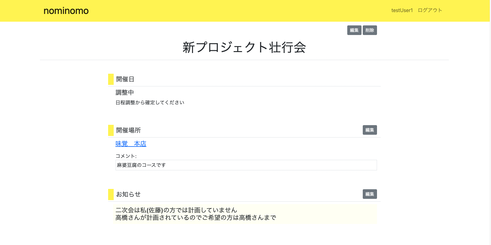
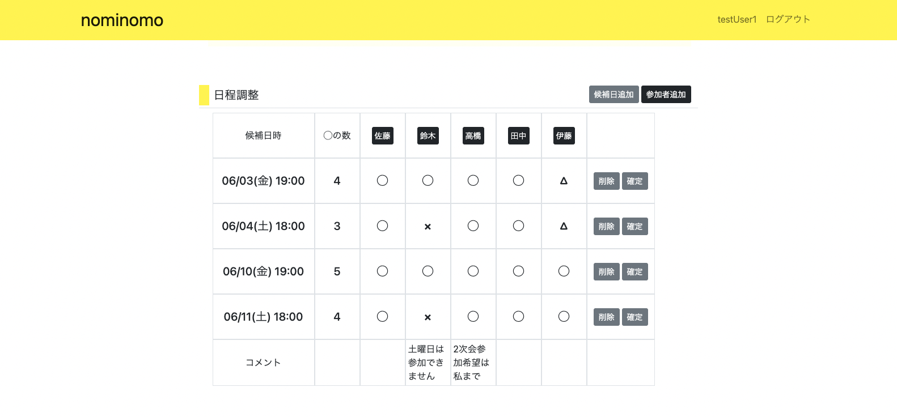
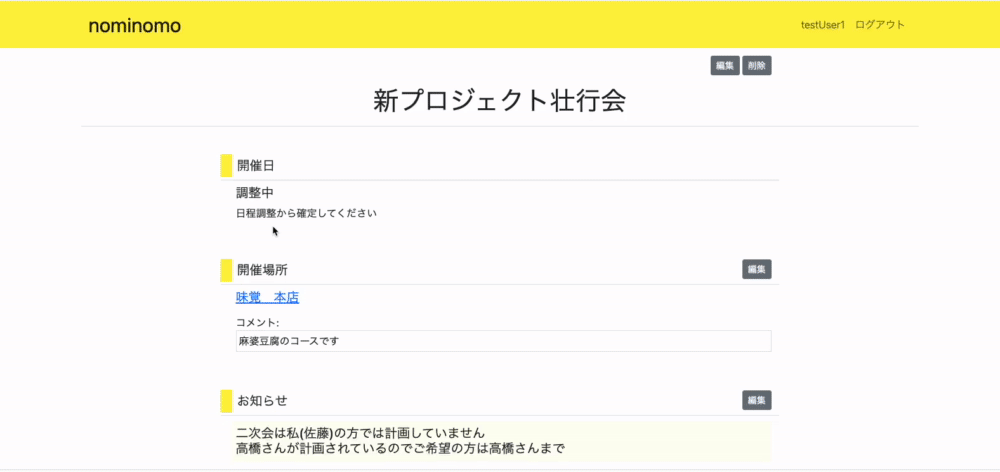
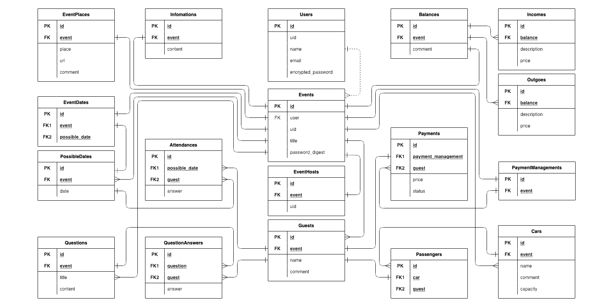
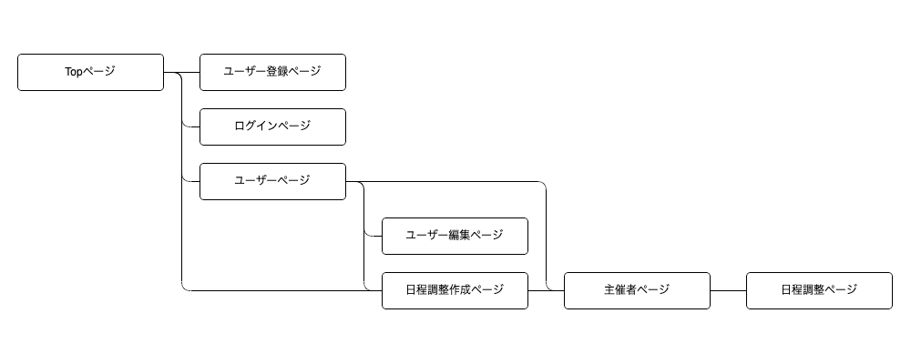

# アプリケーション名
nominomo
 
 

# アプリケーション概要
飲み会の幹事を助ける飲み会に特化した日程調整アプリ。 
アンケート機能や乗り合わせ調整機能などを実装予定。
 
 

# URL
http://nominomo.net 
※ 追加機能実装のため予告なく停止する場合があります
 
 

# テスト用アカウント
- Basic認証ID: study37687f
- Basic認証Password: study37687f
- メールアドレス: testuser1@test
- パスワード: pass1234
- 新プロジェクト壮行会: pass
 
 

# 利用方法
本アプリはcookieを利用しているため、ブラウザの設定でcookieを許可する必要がある
## ユーザー登録
1. Topページのヘッダーからユーザー登録を行う

なお、ユーザー登録を行わなくても利用可能である。
ユーザー登録を行わない場合以下の制限がある。

- ユーザーページ(日程調整一覧)の利用不可
- 別のブラウザ、端末から主催者(幹事)としてアクセスする場合、主催者用URLが必要になる
- (※実装予定)日程調整の保存期限が無期限にならない

## 日程調整
1. Topページもしくはユーザーページから日程調整を作成する
2. イベント名と閲覧パスワード(任意)を入力する
3. ログインしていない場合、主催者ページのURLをブックマークする必要がある
4. 参加者に参加者用URLを通知する
5. 他に主催者役がいる場合、主催者用URLを通知する
6. 日程調整ページから各種調整を行うことができる
 
 

# アプリケーションを作成した背景
職場での懇親会の幹事をしたときに、業務をしながら日程をはじめとする各種調整のメール連絡を頻繁に行わなければならず負担に感じた。 
そのため、幹事の負担を減らせる様なアプリの開発を思い立つに至った。
 
 

# 洗い出した要件
https://docs.google.com/spreadsheets/d/1-s4CTwQhnfxOJ7d44t-skg8lLZg4GL5phUQrc5jFS2U/edit?usp=sharing
 
 

# 実装した機能についての画像やGIFおよびその説明

開催日は日程調整から確定することで表示される
 
 

# 実装予定の機能
乗り合わせ調整機能 
会計報告機能 
ログインせずに作成した調整ページを期限で削除 
各種テストの強化、異常値対応の強化 
 
 

# データベース設計

 
 

# 画面遷移図

 
 

# 開発環境
ruby 3.1.1 
rails 7.0.2.3 
MySQL 8.0.23 
Docker 4.7.1 
 
 

# ローカルでの動作方法
以下のコマンドを順に実行。
% git clone https://github.com/tomokazu-sema/nominomo 
% cd nominomo 
% bundle install 
% yarn install  
% yarn build:css 
% rails db:create db:migrate 
※ /config/database.ymlを修正ください (password, host) 
 
 

# 工夫したポイント
## ログインしなくても使用可能とする
飲み会の日程調整という理由だけで、全てのユーザーにユーザー登録してもらうことは難しいため、ユーザー登録なしでも利用できる様にした。 
具体的には、

- URLをランダム文字列として認証の代わりに
- 閲覧パスワードを任意で設定可能
- Cookieを利用したページ利用者の判別

を実装した。 
 

## ネイティブアプリの操作性を重視
メインコンテンツとなる日程調整のページでは、SPAを採用しユーザーが直感的に操作できる構成とした。 
Rails7に標準で採用されているTurboを利用し、開発の省力化、コードのメンテナンス性を向上させた。 
 
