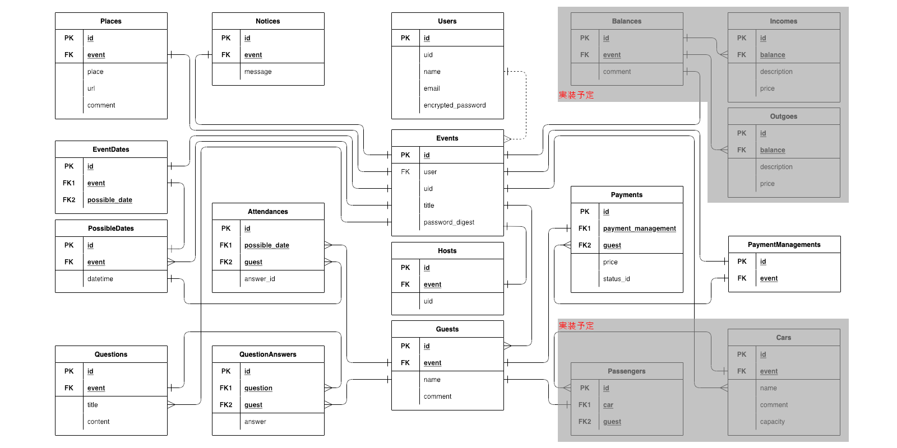

# アプリケーション名
nominomo
 
 

# アプリケーション概要
飲み会の幹事を助ける飲み会に特化した日程調整アプリ。 
アンケート機能や乗り合わせ調整機能などを実装予定。
 
 

# URL
http://nominomo.net
 
 

# テスト用アカウント
- Basic認証ID: study37687f
- Basic認証Password: study37687f
- メールアドレス: testuser1@test
- パスワード: pass1234
 
 

# 利用方法
本アプリはcookieを利用しているため、ブラウザの設定でcookieを許可する必要がある
## ユーザー登録
1. Topページのヘッダーからユーザー登録を行う

なお、ユーザー登録を行わなくても利用可能である。
ユーザー登録を行わない場合以下の制限がある。

- ユーザーページ(日程調整一覧)の利用不可
- 日程調整の保存期限が無期限にならない
- 別のブラウザ、端末から主催者(幹事)としてアクセスする場合、主催者用URLが必要になる

## 日程調整
1. Topページもしくはユーザーページから日程調整を作成する
2. イベント名と閲覧パスワード(任意)を入力する
3. ログインしていない場合、主催者ページのURLをブックマークする必要がある
4. 参加者に参加者用URLを通知する
5. 他に主催者役がいる場合、主催者用URLを通知する
6. 日程調整ページから各種調整を行うことができる
 
 

# アプリケーションを作成した背景
職場での懇親会の幹事をしたときに、業務をしながら日程をはじめとする各種調整のメール連絡を頻繁に行わなければならず負担に感じた。 
そのため、幹事の負担を減らせる様なアプリの開発を思い立つに至った。
 
 

# 洗い出した要件
https://docs.google.com/spreadsheets/d/1-s4CTwQhnfxOJ7d44t-skg8lLZg4GL5phUQrc5jFS2U/edit?usp=sharing
 
 

# 実装した機能についての画像やGIFおよびその説明
準備中
 
 

# 実装予定の機能
日程調整機能 
アンケート機能 
乗り合わせ調整機能 
会費管理機能 
会計報告機能 
 
 

# データベース設計

 
 

# 画面遷移図

 
 

# 開発環境
ruby 3.1.1 
rails 7.0.2.3 
MySQL 8.0.23 
Docker 4.7.1 
 
 

# ローカルでの動作方法
準備中
 
 

# 工夫したポイント
準備中
